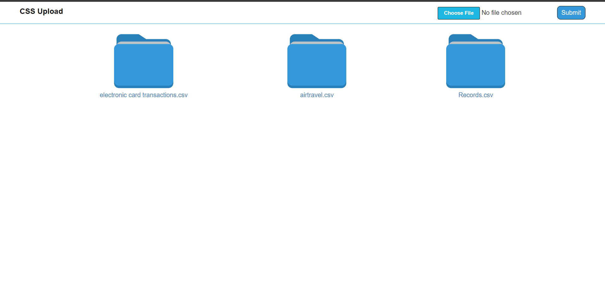
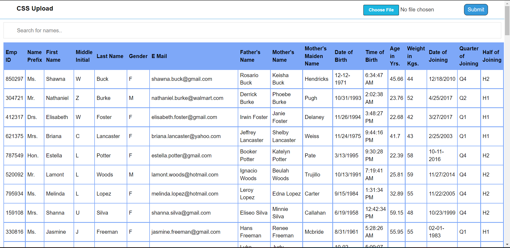

## Hosted Link -- https://csv-reader-178.herokuapp.com/

# Video

[](https://www.youtube.com/watch?v=aEGV_a5r-Pk)

# READ CSV FILE AND DISPLAY IT IN TABLE

### Description

`Read upload csv file in database and read the data in form of table`

## Folder Structure

```
csv upload
├─ .gitignore
├─ assets
│  ├─ css
│  │  ├─ home.css
│  │  ├─ index.css
│  │  └─ open.css
│  ├─ image
│  │  └─ folder image.png
│  └─ js
│     └─ index.js
├─ config
│  ├─ environment.js
│  └─ mongoose.js
├─ controllers
│  ├─ fileDisplay_Controller.js
│  ├─ fileUpload_Controller.js
│  └─ home_controller.js
├─ githubreadme
│  ├─ 1.png
│  └─ 2.png
├─ index.js
├─ logs
│  └─ access.log
├─ models
│  └─ files.js
├─ package-lock.json
├─ package.json
├─ README.md
├─ routes
│  └─ index.js
├─ uploads
│  ├─ files
│  │  ├─ file-1659970168953-304232727
│  │  ├─ file-1659970174137-599614137
│  │  └─ file-1659970345341-915924816
│  └─ index.js
└─ views
   ├─ header.ejs
   ├─ home.ejs
   ├─ layout.ejs
   └─ open.ejs

```

## Some ScreenShots of Project



